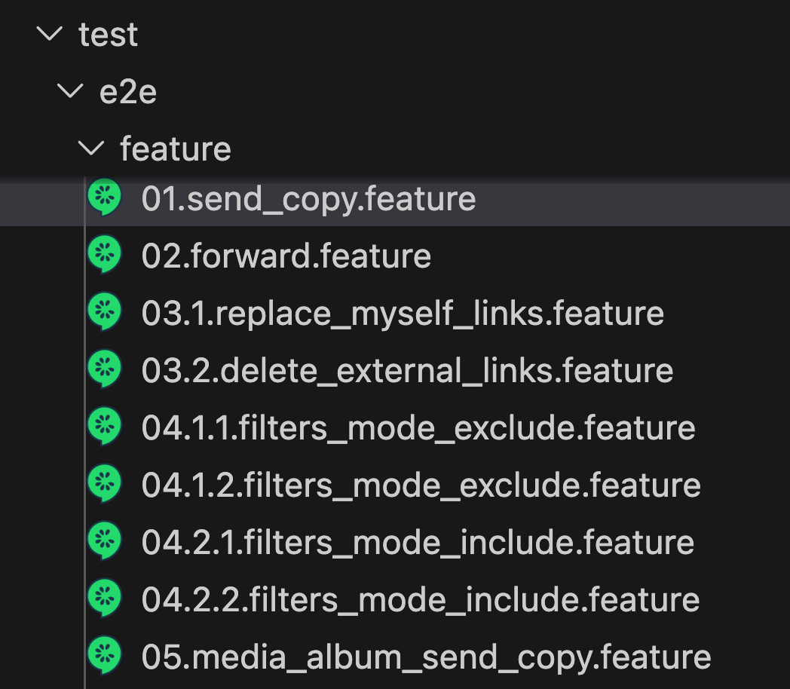
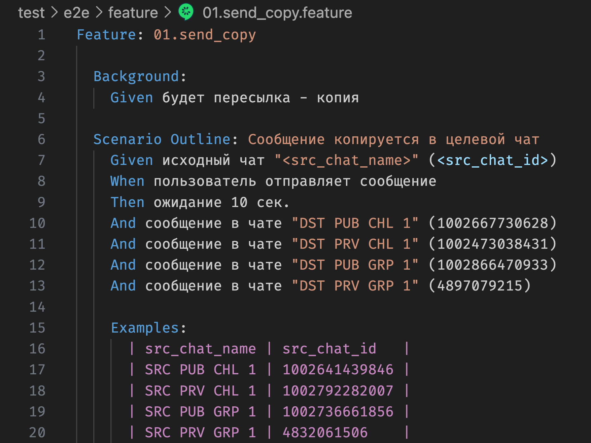
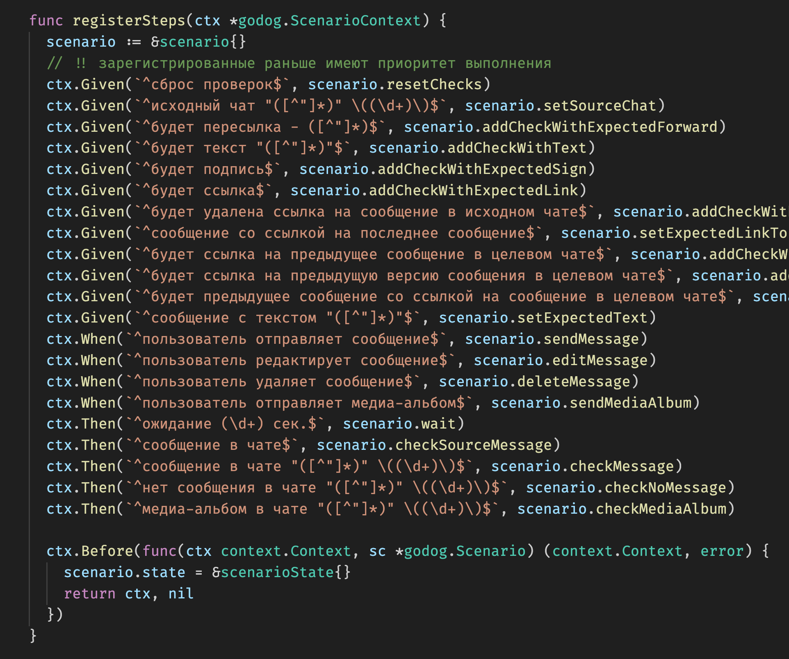
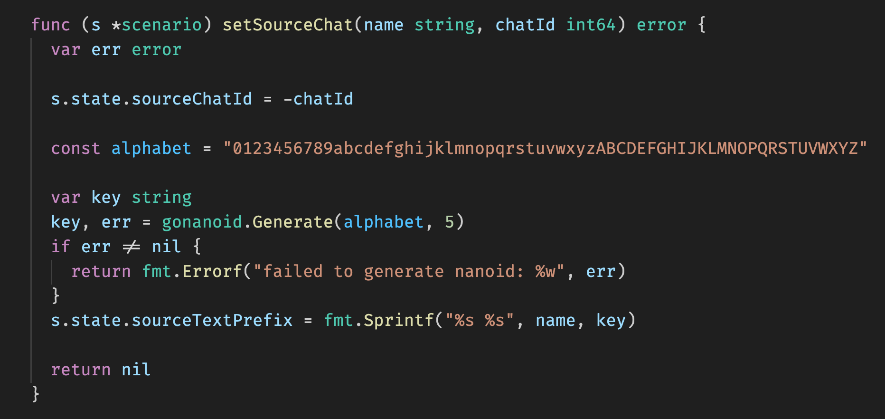
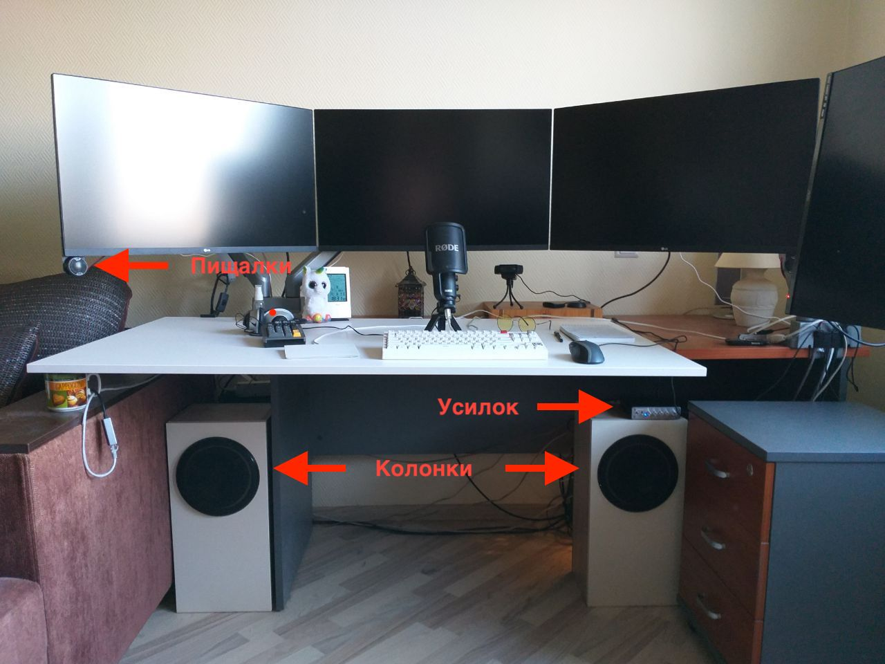

# Claude Code: как я переписал сервис за неделю вместо трёх месяцев


Год назад у меня был legacy-проект с одним `main.go` на две тысячи строк. MVP: бизнес-логика, конфиг, хэндлеры, БД - всё в одном файле. Три месяца в Cursor, аккуратно, по кусочкам, с тестами на коленке, я вытянул это в нормальную структуру. Три месяца...

А недавно я сел переписывать другой свой проект такого же масштаба. Claude Code, Opus, три субагента-ревьювера, тридцать скилов. Неделя. И это я ещё половину времени потратил на BDD, потому что поверх всего накатывал реализацию на godog. Без BDD уложился бы дня за три!

Расскажу про свой тулчейн [`level85`](https://github.com/pure-golang/level85/), через который получил эту разницу. Не "десять советов как заставить нейронку писать код", а как я дошёл до такой конфигурации, что делает её рабочей, и где я продолжаю наступать на грабли.

## Почему терминал, а не плагин

Первое, что надо сделать человеку, который всё ещё сидит в Cursor или KiloCode: открыть терминал и запустить там Claude Code. Плагин для VS Code у Anthropic есть, субагенты и скилы он тоже умеет, но терминал даёт то, чего плагин не даёт: несколько независимых сессий рядом в отдельных окнах или табах, кастомный statusline с расходом лимитов, и в целом более предсказуемое поведение без прослойки IDE.

Я называю Cursor и KiloCode "дилерами из Бруклина с разбавленной наркотой". Они берут чужие модели, прокладывают свой слой, что-то кэшируют, что-то режут, что-то подмешивают. Anthropic делает один инструмент под одну модель, которая лучше всех остальных для кодинга.

### Warp как правильный выбор

Изначально я выбрал Ghostty в качестве терминала. Shift+Enter из коробки в TUI Claude Code: перенос строки работает одинаково и в терминальной сессии, и в GUI-расширении Claude для VS Code, мышечная память не ломается при переключении между окнами. Ghostty это хороший терминал, и эта фича у него есть по умолчанию. В системном Terminal и под TMUX перенос строки идёт только через CTRL+J, это неудобно.

Потом я обнаружил, что Warp тоже умеет Shift+Enter из коробки, а сверху даёт пачку вещей, которых у Ghostty нет: нативная интеграция с Claude Code (иконки состояния задачи на табах, нотификации при завершении), rich input, встроенный file explorer, выбор цвета и редактируемые подписи на табах. Warp меня очаровал, дальше больше.

### Фичи Warp, которые двигают работу

Ниже пять вещей, которые я использую каждый день.

Первое, горизонтальные табы. Warp двигает идеологию блоков и сплитов внутри одного окна, но табы закрыли другой сценарий: несколько независимых рабочих контекстов рядом. У меня обычно открыто несколько табов одновременно: backend, frontend, level85, чистый шелл под разовые команды.

Второе, нативная интеграция с Claude Code. Статус агента отображается значком-бейджем на табе: пурпурные часы пока сессия работает, зелёная галочка при успехе, красный треугольник при ошибке, жёлтый stop когда агент ждёт approve, серый stop если отменил вручную. Плюс при завершении задачи в углу таба появляется небольшая точка непрочитанного уведомления в акцентном цвете темы, она пропадает когда переключаюсь на таб. Это важно для долгих задач: запускаешь, уходишь в другой таб, правишь соседний проект, а когда задача завершилась, Warp выдаёт нотификацию и подсвечивает таб точкой.

Третье, "rich input". Режим ввода, в котором многострочный промт редактируется как в нормальном редакторе: подсветка синтаксиса для команд, нормальные стрелки по строкам, копипаста. Убирает неудобство сырого TTY, когда в Claude пишешь промт на 40 строк с несколькими блоками кода. В мою мышечную память режим ещё до конца не вписан, но направление правильное, и для длинных осмысленных промтов это наиболее подходящий способ ввода.

Четвёртое, встроенный файловый обозреватель. Боковая панель со структурой проекта, можно кликать по файлам, открывать их, аттачить пути как контекст в текущую агентную сессию. Типовой кейс: нужно найти файл в проекте и скопировать его путь. Раньше за этим приходилось переключаться в VS Code, теперь хватает Warp.

Пятое, цветные ярлыки на табах с кастомными именами. Держу две сессии Claude в одном окне: синий таб с подписью "backend", оранжевый "frontend". При быстром переключении между ними промахнуться невозможно.

## Контекст это всё

Главный ресурс при работе с Claude Code - это контекстное окно. У Sonnet 200K, у Opus 1M (и это дорого). На старте, до того как написано хоть одно слово, системные промты и инструменты занимают около 9%. Команда `/context` показывает, на что именно уходит контекст: системка, инструменты, MCP. Сколько токенов занимает каждый скилл, субагент, CLAUDE.md, история сообщений.

И вот главный антипаттерн, на который я натыкался сам и видел у коллег.

Огромный `CLAUDE.md` на 2000 строк, куда собраны все правила проекта: как именовать переменные, как писать тесты, как коммитить, как делать миграции, куда раскладывать файлы etc. Всё в одном файле, всё грузится в каждый промт, 30-40 тысяч токенов уходит ещё до того, как нейронка увидела твой код.

Я переубедил своего лида как раз на этом. Он тащил DOD.md (Definition of Done), большой документ со всеми правилами готовности. Я показал цифры: DOD.md в каждой сессии, это постоянный расход. Декомпозиция тех же правил на отдельные скилы плюс эталонный проект, это расход только когда скил реально нужен. В сумме разница получается ощутимая.

## Skills, декомпозиция правил

Скил в Claude Code устроен просто. Это отдельная папка внутри `.claude/skills/`, в ней `SKILL.md` с фронтматтером:

```
---
name: x-bdd-red
description: Генерация скелета godog-шагов по .feature файлам. Использовать перед green-фазой.
---
```

Фронтматтер (name + description) читается агентом сразу, как индекс. Тело подгружается только тогда, когда агент решил, что скил релевантен задаче.

Префикс `x-` у моих кастомных скилов не случайно. Claude Code имеет встроенные слэш-команды, и если твой скил называется `commit`, он конфликтует. `x-commit`, `x-bdd-red`, `x-doc-go`, так избегаю возможных конфликтов.

У меня в тулчейне `level85` сейчас 25 собственных скилов. Они все на русском. Это сознательно: скилы это командное соглашение "как мы пишем код", их читают и люди и Claude. Если вся команда русскоязычная, нужно донести смысловые ньюансы.

Важное правило, к которому я пришёл через боль: скил должен быть командой в повелительном наклонении. Не "в нашей команде принято использовать", а "используй". Не "рекомендуется покрывать тестами", а "покрой тестами до 80%". Claude это армия туповатых миньонов, а не волшебник. Миньонам нужны приказы.

Ещё одна штука, которая неочевидна: примеры кода инлайнятся в сам `SKILL.md`, не выносятся в отдельные references. Если вынес, агент их не прогрузит. Он видит ссылку и идёт дальше. Пример должен лежать в теле скила, тогда он попадает в контекст.

### Техника "я джун, ты эксперт, проанкетируй меня"

Эта техника работает, когда в голове есть знание, которое нужно вытащить в скилл, но сформулировать самому сложно. Claude сам задаёт вопросы, ты отвечаешь, на выходе готовый `SKILL.md`. Помогает, когда правило чувствуется, но не формализуется: серия уточняющих вопросов превращает интуицию в явный текст.

## Субагенты-ревьюверы

У меня три субагента: `dod-reviewer`, `test-reviewer`, `bdd-reviewer`.

Субагент, это статический набор скилов плюс отдельный контекст. Когда основной агент вызывает ревьювера, тот стартует с чистым контекстным окном, загружает свой набор обязательных скилов и делает проверку.

Ключевая идея: ревьювер, это тонкая обёртка над скилами. Сам по себе он не знает правил. Он знает, что "я проверяю тесты, мои скилы это `x-testing-conventions`, `x-test-matrix`, `x-mockery`". Когда его просят отревьюить PR, он загружает свои скилы и по ним проверяет.

Почему это важно. Правила живут в одном месте, у владельца скила. Если я поменял требования к именованию тестов, я правлю `x-testing-conventions/SKILL.md`, и ревьювер автоматически начинает проверять по-новому. Никакой дубликации.

У меня есть `AGENTS.md` с таблицей "тема -> владелец скила". 17 тем, у каждой единственный канонический владелец. Если встречается правило, которое нигде не владеется, оно либо попадает в существующий скил, либо под него создаётся новый. Не "ещё один хак в корневой CLAUDE.md".

Есть ещё штука, которую я называю restricted skills. Например, `x-commit` никогда не коммитит сам, если пользователь явно не сказал "закоммить". Это жёсткое правило в самом скиле, и оно защищает от ситуации, когда нейронка в процессе работы выполняет `git commit -am "stuff"` в середине задачи.

### Делай всё через субагентов

Это правило я довёл до автоматизма. Основной контекст сессии конечен. Если вести всю работу в главной ветке разговора, быстро упираешься в лимит и теряешь ход мысли. Решение: любую самостоятельную подзадачу (чтение большого файла, анализ репы, поиск по кодовой базе, даже написание большого куска текста) отдавай субагенту. Субагент работает в изолированном контексте, возвращает в основную сессию только результат-саммари. Главный контекст остаётся чистым и вмещает всю картину проекта.

## Эталонный проект

Вероятно, самый мощный рычаг, который я нашёл.

У меня есть проект [`budva`](https://github.com/pure-golang/budva/), сервис пересылки сообщений в Telegram на TDLib, написанный на Go. Это мой эталон. Цифры:

- 18500 строк кода
- 13506 строк тестов
- 25 feature-файлов
- 46 BDD-сценариев (с Examples разворачиваются в ~443 прогонов)
- 439 юнит-тестов
- 98% покрытия

Clean Architecture: `cmd/` для entry points, `internal/domain` чистые типы без зависимостей, `internal/service` use cases, `internal/repo` адаптеры к внешним системам, `internal/transport` для grpc/http/term.

Частично применяемые интерфейсы. Это когда у каждого потребителя свой локальный интерфейс только с теми методами зависимости, которые он реально использует. Не "большой `UserRepository` на 20 методов", а "в этом сервисе я использую только `GetByID` и `Save`, вот интерфейс из двух методов". Моки под это генерирует [`mockery`](https://github.com/vektra/mockery/).

В каждом пакете `doc.go` - 26 штук. Claude автоматически читает `doc.go` при обращении к пакету и поддерживает его в актуальном состоянии - навсегда! Если я меняю публичный API пакета, следующий промт в этой области обновит и `doc.go` тоже. Это бесплатная документация.

Зачем эталон нейронке. Когда я прошу "добавь новый use case для пересылки по расписанию", я пишу "посмотри как сделаны звонки и сделай по аналогии". Claude идёт в `internal/service/calls/`, смотрит структуру, смотрит тесты, смотрит интерфейсы, и генерит новый модуль по тому же шаблону. Без эталона он начинает изобретать: где-то в сервисе логика, где-то в репе, имена разные, структура разная. С эталоном, копия под копирку, только с новой бизнес-логикой.

## BDD и Claude, идеальная пара


Картинка про качели: заказчик, аналитик, дизайнер и разработчик видят один и тот же проект абсолютно по-разному, и на выходе получается франкенштейн. BDD и его синтаксис Given/When/Then закрывают этот разрыв: сценарий пишется почти обычным русским (или английским), а потом превращается в рабочий тест на чём угодно, хоть JS, хоть Go. Claude заходит в эту схему хорошо: отдал ему постановку задачи, получил готовые `.feature`-файлы, а дальше он же и шаги под них напишет.

У меня в `level85` реализован жёсткий RGB-цикл:

- **Red**: генерируется скелет godog-шагов по `.feature` файлу. Всё падает, это нормально.
- **Green**: сценарии зеленятся по одному. Запрет параллелить незелёные сценарии, иначе нейронка путается в контексте, начинает править один и ломать соседний.
- **Blue**: когда все сценарии зелёные, идёт рефакторинг. Только под зелёными тестами.

Матрица тестирования пишется как отдельный артефакт до кодирования. Порядок покрытия: сначала интеграционные и smoke, юниты в конце. Это контринтуитивно, но работает: сначала убеждаешься что система в целом собрана правильно, потом уже точечно покрываешь ветки.



Файлы .feature



Фича (user story) состоит из нескольких сценариев (use cases). Scenario Outline с таблицей Examples сворачивает десятки комбинаций в один короткий читаемый сценарий.



Регистрация шагов.



Реализация шагов.

## Тулчейн level85

Все мои проекты лежат на одном уровне каталога: `~/pure-golang/level85/`, `~/pure-golang/budva/`, `~/pure-golang/geo/`, и так далее. В каждом рабочем проекте симлинки: `.claude -> .agents -> ../level85/.agents`, плюс `AGENTS.md -> ../level85/AGENTS.md`, а корневой `CLAUDE.md` содержит просто `@AGENTS.md`. Так скилы редактируются в одном месте, а подхватываются во всех проектах сразу.

VS Code workspace держу на уровне каталога всех проектов, не одного. Левый монитор - рабочий проект, правый монитор - level85 или эталонный проект. В центре - Warp с Claude. Правки скилов через симлинк распространяются на все проекты команды сразу, без копирования и без синхронизации вручную.



Мониторная болезнь со звуковым оформлением.

### statusline-command.sh

Кастомный statusline из `level85` (`scripts/statusline-command.sh`). Держит в одной строке:

- процент заполнения контекстного окна
- расход 5-часового rate-limit (session) с временем до сброса
- расход недельного rate-limit (7-day) с временем до сброса

Подключается через `~/.claude/settings.json`:

```json
{
  "statusLine": {
    "type": "command",
    "command": "bash ~/.claude/statusline-command.sh"
  }
}
```

<details>
<summary>Исходник statusline-command.sh</summary>

```bash
#!/bin/sh
# Claude Code status line — compact format

input=$(cat)

# Context usage percentage
used=$(echo "$input" | jq -r '.context_window.used_percentage // empty')

# Session (5-hour) rate limit
session_used=$(echo "$input" | jq -r '.rate_limits.five_hour.used_percentage // empty')
session_resets=$(echo "$input" | jq -r '.rate_limits.five_hour.resets_at // empty')

# Weekly (7-day) rate limit
week_used=$(echo "$input" | jq -r '.rate_limits.seven_day.used_percentage // empty')
week_resets=$(echo "$input" | jq -r '.rate_limits.seven_day.resets_at // empty')

# Nothing to show if no context data
[ -z "$used" ] && exit 0

ctx_int=$(printf '%.0f' "$used")
output="${ctx_int}%"

if [ -n "$session_used" ]; then
  session_used_int=$(printf '%.0f' "$session_used")
  if [ -n "$session_resets" ]; then
    now=$(date +%s)
    remaining_secs=$((session_resets - now))
    if [ "$remaining_secs" -le 0 ]; then
      time_str="resets now"
    else
      remaining_mins=$((remaining_secs / 60))
      remaining_hrs=$((remaining_mins / 60))
      remaining_mins_part=$((remaining_mins % 60))
      if [ "$remaining_hrs" -gt 0 ]; then
        time_str="${remaining_hrs}h${remaining_mins_part}m"
      else
        time_str="${remaining_mins}m"
      fi
    fi
    output="${output} :: ${session_used_int}% (${time_str})"
  else
    output="${output} :: ${session_used_int}%"
  fi
fi

if [ -n "$week_used" ]; then
  week_used_int=$(printf '%.0f' "$week_used")
  if [ -n "$week_resets" ]; then
    now=$(date +%s)
    remaining_secs=$((week_resets - now))
    if [ "$remaining_secs" -le 0 ]; then
      week_time_str="resets now"
    else
      remaining_mins=$((remaining_secs / 60))
      remaining_hrs=$((remaining_mins / 60))
      remaining_days=$((remaining_hrs / 24))
      remaining_hrs_part=$((remaining_hrs % 24))
      if [ "$remaining_days" -gt 0 ]; then
        week_time_str="${remaining_days}d${remaining_hrs_part}h"
      else
        week_time_str="${remaining_hrs}h"
      fi
    fi
    output="${output} :: ${week_used_int}% (${week_time_str})"
  else
    output="${output} :: ${week_used_int}%"
  fi
fi

printf '%s' "$output"
```

</details>

Зависимость одна: `brew install jq`. Сам скрипт кладётся командой `cp ../level85/scripts/statusline-command.sh ~/.claude/`.

Это важно когда работаешь по 8+ часов в день: видно заранее что через час закончится недельный лимит и можно распланировать работу, а не упереться в лимит внезапно. Когда в статуслайне 82% контекста, это сигнал дробить задачу или начинать новый чат.

### Bypass permissions on

В `~/.claude/settings.json` можно включить режим `bypassPermissions`, чтобы Claude не переспрашивал каждое действие (Edit, Bash и прочее). На проде опасно, в dev-окружении экономит часы. Конфиг из level85, требуется установить две опции:

```json
{
  "permissions": {
    "defaultMode": "bypassPermissions",
  },
  "skipDangerousModePermissionPrompt": true
}
```

Альтернатива в интерфейсе: Shift+Tab переключает режимы (default, accept-edits, plan). Bypass в этот цикл по умолчанию не входит, его включают через флаг `--dangerously-skip-permissions` или через `defaultMode` в settings.json. Использовать осознанно, в sandbox или на feature-ветке, никогда на main.

## Полезные команды и режимы модели

Есть одна фраза, которая у меня работает надёжно: "разбей задачу на граф зависимостей и выполняй параллельно". Claude вытаскивает из задачи независимые куски, раскидывает их по субагентам и запускает десятки потоков одновременно.

### "ultrathink"

Ключевое слово в промте, которое включает расширенный режим размышления: в Claude Code оно подсвечивается в поле ввода переливающейся радугой, а модель получает максимальный бюджет на reasoning. Модель дольше обрабатывает задачу перед ответом и лучше видит связи между частями. Включаю для архитектурных решений, разбора непонятных багов, любых задач где важна глубина, а не скорость.

### /model opusplan

Гибридный режим Claude Code. В режиме plan работает Opus (дорогая умная модель, строит план), в режиме execution переключается на Sonnet (дешевле и быстрее, выполняет шаги по плану). Экономия ощутимая: планировщик расходует малую долю токенов, основной расход в исполнении. Для ежедневной работы это разумный дефолт: думать Opus, делать Sonnet.

### Голосовой ввод

Голосовой ввод ускоряет формулировку промтов, и промпты на голос получаются длиннее и детальнее. На слабом компе без видеокарты рекомендую [Handy](https://handy.computer/): быстро работает на CPU и корректно распознаёт числительные и английские аббревиатуры. Под русский я подгружаю модель "GigaAM v3". На мощном железе беру [FluidVoice](https://altic.dev/fluid) и подгружаю модель "Parakeet TDT v3". Системный маковский диктор работает хуже для длинных технических формулировок.

### Базовый Taskfile

Рабочие проекты включают Taskfile из тулчейна `level85` через `includes`, получают команды бесплатно.

```yml
# Taskfile.yml
version: "3"

includes:
  common:
    taskfile: ../level85/Taskfile.yml
    flatten: true
```

## Практические наблюдения

### Переписывать лучше в той же кодовой базе

Первое желание при рефакторинге: "создам новый репо и туда перенесу". На Claude это не работает. Нейронке нужен контекст, где можно разбираться. Когда она видит старые куски рядом с новыми, она понимает чем заменяет что. Перенос в чистый репо превращается в угадайку.

Делаю по-другому: работаю внутри того же репо итеративно. Старые файлы постепенно заменяются новыми, тесты растут поверх рабочего кода. Минус очевидный: в старом проекте остаётся мусор. Как это правильно вычищать в конце, я ещё не решил. Есть ощущение что нужен отдельный скил `x-dead-code-sweep`, но руки пока не дошли.

### Файл кода меньше 500 строк

После 500 строк в одном файле Claude начинает путаться. Контекст окна ещё хватает, но внимание размывается. Он может дважды написать одну функцию в разных местах файла, или забыть что выше уже есть нужный хэлпер.

Тесты могут быть длиннее, т.к. Claude работает с конкретным тестом и не смотрит на другие части файла.

### Дополнительный тюнинг скилов через диалог

Когда нейронка ошибается, я спрашиваю её: "почему ты приняла такое решение, какое правило тебе не хватало, куда бы ты его дописала". Она отвечает прямо: "я не увидела правила про именование миграций, его стоило добавить в `x-db-migrations` в разделе наименования". Окей, разрешаю отредактировать скил.

## Заключение

Что можно сделать сегодня:

1. Поставить Claude Code в терминале, под Warp.
2. Взять свой самый большой `CLAUDE.md` и разделить на три-пять скилов по темам.
3. Добавить префикс `x-` к именам скилов.
4. Написать в скилах командами в повелительном наклонении.
5. Запустить `/context` и посмотреть, куда уходит контекст.
6. Включить кастомный statusline, чтобы видеть расход лимитов в реальном времени.
7. Попробовать `/model opusplan` как дефолт для ежедневной работы.

А мне ещё разбираться с тем, как убирать мусор после итеративного рефакторинга. Если у кого-то есть работающий подход, напишите в комментах.
